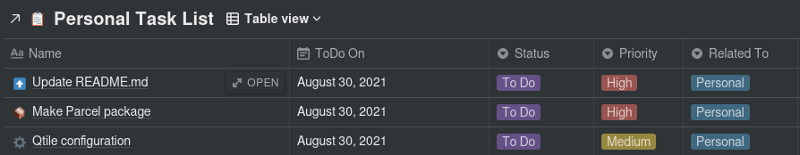
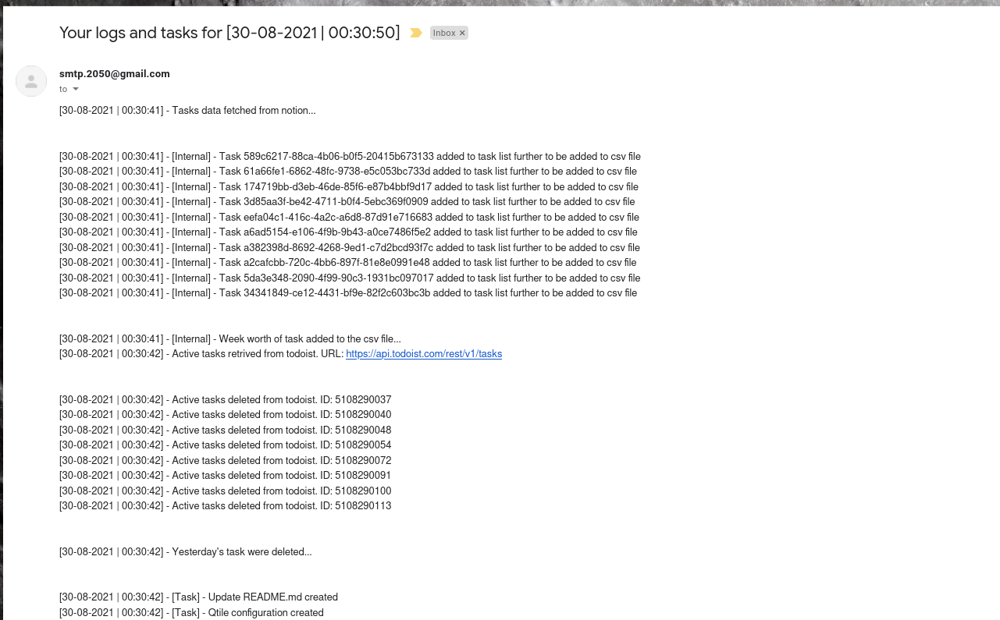

Notion Todoist Integration
================================================================================

What is this project?
--------------------------------------------------------------------------------

Well I maintain a Todo-list in notion with certain tasks and tags that go with them
and it works out great for me.

The problem is that notion currently doesn't have a widget for android phone and sometimes the layout on the phone appears weirded out. So I decided to use todoist
app to build kind of an automated widget which shows all of my notion tasks 
right on the home screen.

After the tasks have been run it emails me the logs of the run.

Things I Used
--------------------------------------------------------------------------------

- Python
  
- [Notion API](https://developers.notion.com/)
  
- [Todoist API](https://developer.todoist.com/)
  